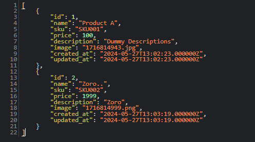
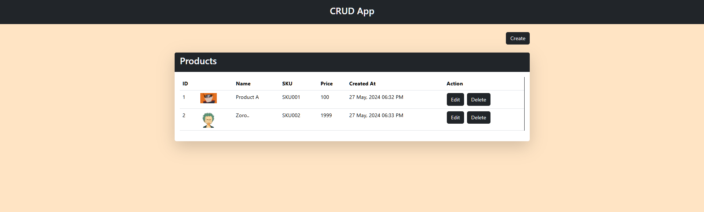
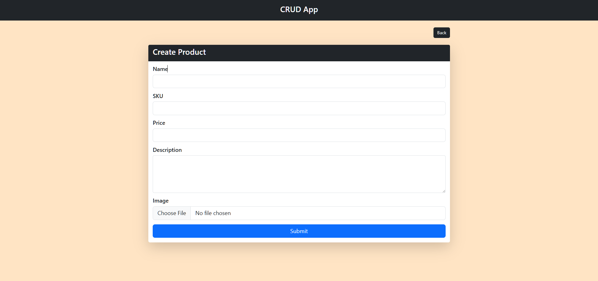
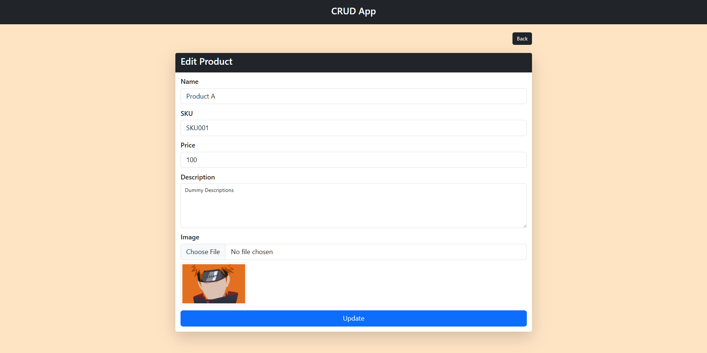

## **CRUD APP**

A Minimal CRUD Application that fetches product list from database from backend and displays it on frontend.

**Technologies Used**

-   Laravel [11.5.0]
-   PHP [8.3.6]
-   [Database - SQLite]

**Installation**

1.  **Navigate to the project directory:**

2.  **Install Composer dependencies:**
    ```
    composer install
    ```
3.  **Copy the example environment file and configure:**
    ```
    cp .env.example .env
    ```
4.  **Generate an application key:**
    ```
    php artisan key:generate
    ```
5.  **Run database migrations:**
    ```
    php artisan migrate
    ```
6.  **Install NPM dependencies:**
    ```
    npm install
    ```
7.  **Start the Vite development server:**
    ```
    npm run dev
    ```
8.  **Running the Project:**

    ```
    php artisan serve
    ```

**API Routes**

The application defines the following routes:
`http://127.0.0.1:8000/api/products`




**Product Management Routes (grouped)**

-   **`/`**

    Displays a list of all products.

    


-   **`/products/create`**

    Displays the form to create a new product.

    


-   **`/products/{id}/edit`**

    Displays the form to edit an existing product.

    
    

-   **DELETE `/products/{product}`:** Deletes an existing product (`products.destroy`)

**Notes:**

-   These routes are controlled by the `ProductController`.
